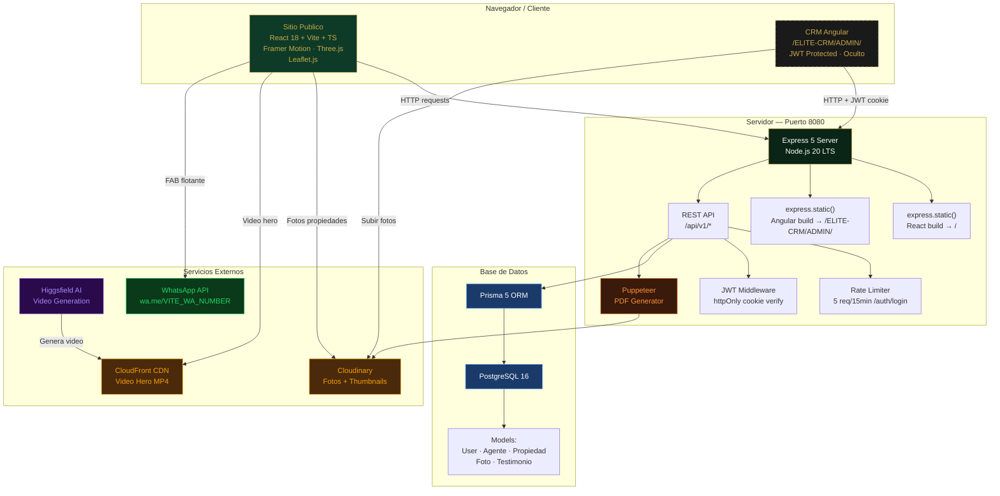

# Diagrama 1: Arquitectura General — ELITE Nuvia

**Proposito:** Vision completa del sistema: todos los subsistemas, servicios externos y sus relaciones.  
**Audience:** Equipo tecnico, stakeholders, nuevos desarrolladores.  
**Formato:** Mermaid (editable) + descripcion textual.

---

---

## Descripcion de Componentes

| Componente | Tecnologia | Rol |
|---|---|---|
| **Sitio Publico** | React 18 + Vite + Framer Motion + Three.js | Interface publica — marketing, listado de propiedades, agentes |
| **CRM Angular** | Angular 17 + Angular Material | Interface privada — gestion de propiedades, agentes, leads. Oculto, sin links publicos |
| **Express Server** | Node.js 20 + Express 5 | Sirve ambos builds estaticos + API REST en el mismo puerto 8080 |
| **API REST** | Express routes + Prisma | Endpoints publicos (propiedades, agentes) y privados (CRUD CRM) |
| **JWT Middleware** | jsonwebtoken + httpOnly cookie | Protege todas las rutas `/ELITE-CRM/ADMIN/*` y rutas API privadas |
| **Rate Limiter** | express-rate-limit | Max 5 intentos de login por IP cada 15 minutos |
| **PDF Generator** | Puppeteer headless | Genera PDF de propiedad con fotos, ficha tecnica, datos del agente y QR WhatsApp |
| **Prisma ORM** | Prisma 5 | Capa de acceso a datos — schema tipado, migraciones, seeds |
| **PostgreSQL** | PostgreSQL 16 | Base de datos relacional — modelos: User, Agente, Propiedad, Foto, Testimonio |
| **Cloudinary** | Cloudinary SDK | Upload, transformacion y entrega de fotos de propiedades con URLs optimizadas |
| **CloudFront CDN** | AWS CloudFront | Streaming del video hero generado por Higgsfield sin latencia |
| **Higgsfield AI** | Higgsfield API | Genera el video cinematico de lujo para el hero (pre-deploy, una vez) |
| **WhatsApp** | wa.me deep link | FAB flotante en sitio publico — conecta cliente con agente directamente |

---

## Regla critica de seguridad

> El sitio publico (`/`) NO contiene ningun link, boton ni referencia al CRM.  
> La unica forma de acceder es escribir manualmente `/ELITE-CRM/ADMIN/login` en el navegador.  
> La ruta esta excluida de `robots.txt` y del `sitemap.xml`.
