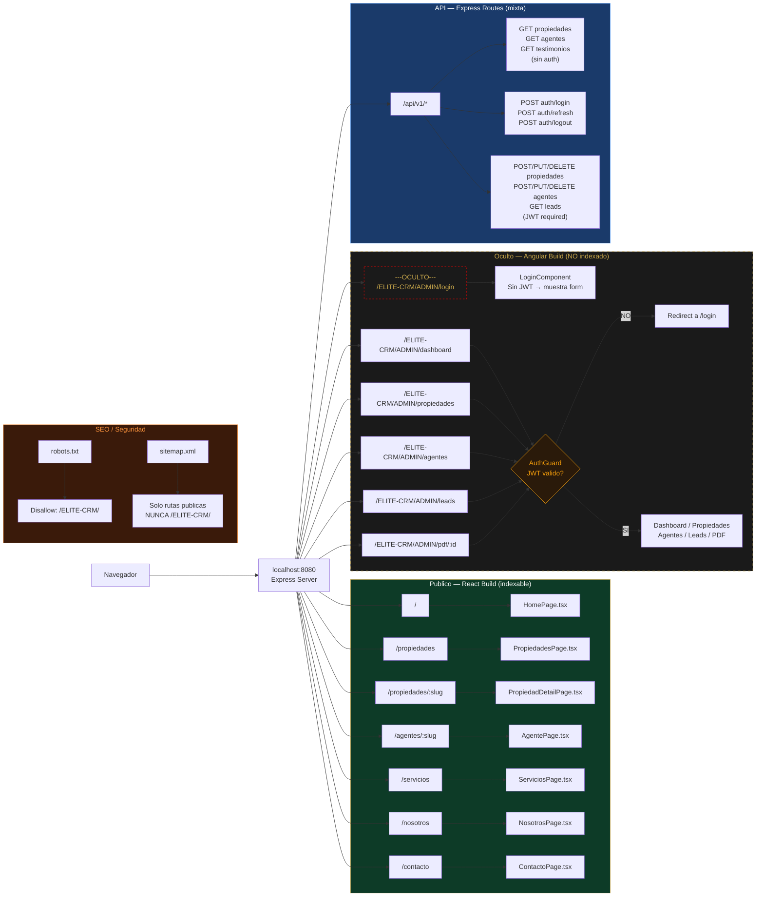

# Diagrama 2: Rutas del Servidor — ELITE Nuvia

**Proposito:** Mapa completo de todas las rutas del servidor unico en puerto 8080.  
**Regla critica:** Ninguna ruta publica enlaza al CRM. El CRM es invisible desde el exterior.

---

---

## Tabla de Rutas

| Ruta | Tipo | Tecnologia | Auth | Indexable |
|---|---|---|---|---|
| `localhost:8080/` | Publica | React SPA | No | Si |
| `localhost:8080/propiedades` | Publica | React SPA | No | Si |
| `localhost:8080/propiedades/:slug` | Publica | React SPA | No | Si |
| `localhost:8080/agentes/:slug` | Publica | React SPA | No | Si |
| `localhost:8080/servicios` | Publica | React SPA | No | Si |
| `localhost:8080/nosotros` | Publica | React SPA | No | Si |
| `localhost:8080/contacto` | Publica | React SPA | No | Si |
| `localhost:8080/ELITE-CRM/ADMIN/login` | **Oculta** | Angular | No (form) | **No** |
| `localhost:8080/ELITE-CRM/ADMIN/dashboard` | **Protegida** | Angular | JWT | **No** |
| `localhost:8080/ELITE-CRM/ADMIN/propiedades` | **Protegida** | Angular | JWT | **No** |
| `localhost:8080/ELITE-CRM/ADMIN/agentes` | **Protegida** | Angular | JWT | **No** |
| `localhost:8080/ELITE-CRM/ADMIN/leads` | **Protegida** | Angular | JWT | **No** |
| `localhost:8080/ELITE-CRM/ADMIN/pdf/:id` | **Protegida** | Angular+Node | JWT | **No** |
| `localhost:8080/api/v1/propiedades*` | API Publica | Express | No | No |
| `localhost:8080/api/v1/agentes*` | API Publica | Express | No | No |
| `localhost:8080/api/v1/testimonios` | API Publica | Express | No | No |
| `localhost:8080/api/v1/auth/*` | API Auth | Express | No/JWT | No |
| `localhost:8080/api/v1/admin/*` | API Privada | Express | JWT | No |
