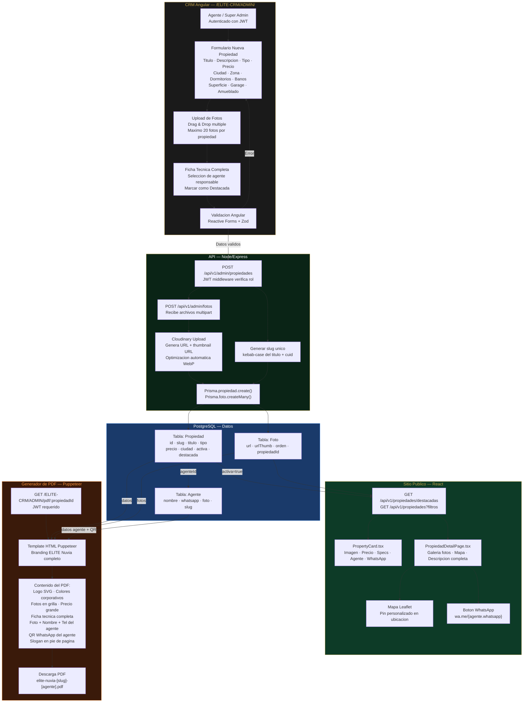
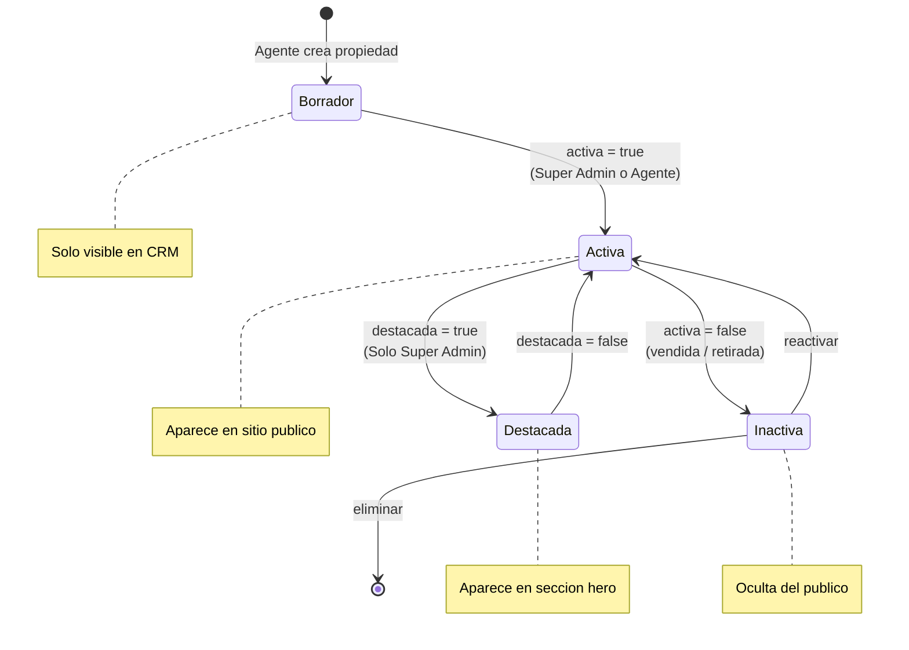

# Diagrama 4: Flujo de Propiedades — CRM a Sitio Publico

**Proposito:** Muestra como una propiedad va desde ser creada en el CRM hasta aparecer en el sitio publico y generar un PDF con branding.

---

---

## Estados de una Propiedad

