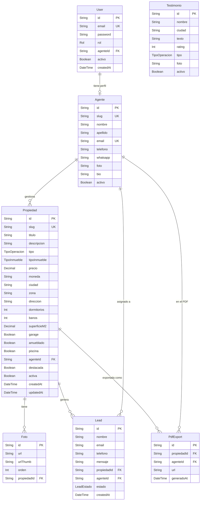
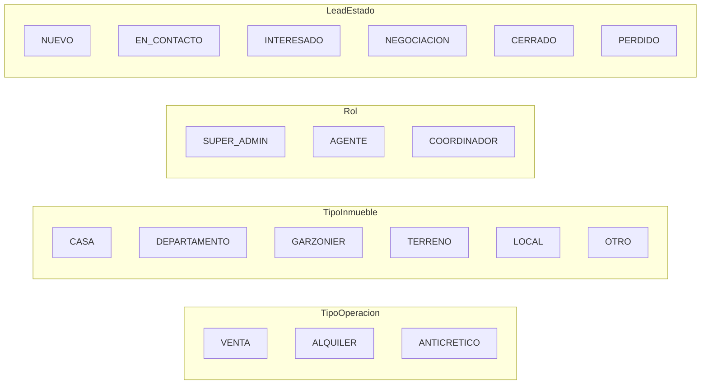

# Diagrama 5: Modelo de Datos — ELITE Nuvia

**Proposito:** Relaciones entre todas las entidades del sistema. Sirve como referencia para el schema Prisma y las migraciones.

---

---

## Enums

---

## Permisos por Rol

| Operacion | SUPER_ADMIN | AGENTE | COORDINADOR |
|---|---|---|---|
| Ver todas las propiedades | Si | Solo las suyas | Si |
| Crear propiedad | Si | Si | No |
| Editar propiedad | Si | Solo las suyas | No |
| Eliminar propiedad | Si | No | No |
| Crear/editar agentes | Si | Solo su perfil | No |
| Ver todos los leads | Si | Solo los suyos | Si |
| Asignar leads a agentes | Si | No | Si |
| Generar PDF | Si | Solo sus propiedades | No |
| Ver reportes globales | Si | No | Si |
| Configuracion del sistema | Si | No | No |
