```mermaid
flowchart TD
    START(["Agente / Admin\nHace click en 'Generar PDF'\nen el CRM"])

    START --> REQ["GET /ELITE-CRM/ADMIN/pdf/:propiedadId\n(Angular abre nueva ventana)"]
    REQ --> AUTH{"JWT Middleware\nVerifica cookie"}
    AUTH -->|"No autorizado"| ERR401["401 — Redirect a login"]
    AUTH -->|"Autorizado"| PERM{"Verificar permiso:\nSuperAdmin O\nAgente propietario"}
    PERM -->|"Sin permiso"| ERR403["403 — Forbidden"]
    PERM -->|"Permitido"| FETCH["Prisma query:\npropiedad + fotos + agente"]

    FETCH --> DATA{{"Datos listos:\n• Propiedad completa\n• Array de fotos (url + urlThumb)\n• Datos del agente\n• whatsapp del agente"}}

    DATA --> QR["Generar QR Code\nqrcode.js: wa.me/{agente.whatsapp}\nBase64 PNG inline"]

    DATA --> TMPL["Puppeteer renderiza HTML template"]
    QR --> TMPL

    subgraph PDF_TEMPLATE["Contenido del PDF (A4)"]
        direction TB
        T1["ENCABEZADO\nLogo SVG ELITE Nuvia (verde + dorado)\nSlogan: TU HOGAR, NUESTRA PASION"]
        T2["HERO FOTO\nFoto principal 100% ancho\n(urlThumb optimizada Cloudinary)"]
        T3["TITULO Y PRECIO\nTitulo propiedad — 24px bold\nBs. 380,000 — dorado grande\nTipo: VENTA / ALQUILER / ANTICRETICO"]
        T4["FICHA TECNICA (tabla)\nCiudad · Zona · Tipo inmueble\nDormitorios · Banos · Superficie m2\nGarage · Amueblado · Piscina"]
        T5["DESCRIPCION\nTexto completo de la propiedad\nFuente Inter · color text-dark"]
        T6["GALERIA DE FOTOS\nGrid 3 columnas (max 9 fotos)\nRedondeadas · sombra suave"]
        T7["AGENTE\nFoto circular agente\nNombre completo — bold\nCargo: Asesor/a Inmobiliaria\nTelefono directo"]
        T8["QR + WHATSAPP\nQR Code 80x80px\n'Escanea para contactarme'\nwa.me/{whatsapp}"]
        T9["PIE DE PAGINA\nLinea dorada separadora\nELITE Nuvia · Ciudad · Telefono\nTU HOGAR, TU FUTURO, NUESTRA PRIORIDAD"]
        T1 --> T2 --> T3 --> T4 --> T5 --> T6 --> T7 --> T8 --> T9
    end

    TMPL --> PDF_TEMPLATE

    PDF_TEMPLATE --> PUPPETEER["Puppeteer page.pdf({\n  format: 'A4',\n  printBackground: true,\n  margin: { top:'20mm', bottom:'20mm' }\n})"]

    PUPPETEER --> BUFFER["Buffer PDF en memoria\n(no se guarda en disco)"]
    BUFFER --> RESP["Response:\nContent-Type: application/pdf\nContent-Disposition: attachment;\nfilename=elite-[slug]-[agente-apellido].pdf"]
    RESP --> DOWNLOAD(["Descarga en navegador del agente"])

    subgraph OPTIONAL["Opcional — Guardar historial"]
        SAVE_LOG["Prisma.pdfExport.create({\n  propiedadId, agenteId,\n  generadoAt: new Date()\n})"]
    end
    BUFFER -.-> SAVE_LOG

    style START fill:#0D3B27,color:#C9A84C,stroke:#C9A84C
    style PDF_TEMPLATE fill:#1a1a1a,color:#C9A84C,stroke:#C9A84C
    style PUPPETEER fill:#3a1a0a,color:#fb923c,stroke:#fb923c
    style DOWNLOAD fill:#0D3B27,color:#C9A84C,stroke:#C9A84C
    style ERR401 fill:#3a0a0a,color:#f87171,stroke:#f87171
    style ERR403 fill:#3a0a0a,color:#f87171,stroke:#f87171
```

# Diagrama 6: Flujo de Generacion de PDF

**Proposito:** Proceso completo para generar el PDF de propiedad con branding ELITE Nuvia, fotos, ficha tecnica, datos del agente y QR de WhatsApp.

---



---

## Especificacion Visual del PDF

```
┌─────────────────────────────────────────────┐
│  [LOGO ELITE NUVIA]    TU HOGAR, NUESTRA PASION│  ← Header (verde oscuro)
├─────────────────────────────────────────────┤
│                                             │
│         [FOTO PRINCIPAL]                    │  ← 100% ancho, 200px alto
│                                             │
├─────────────────────────────────────────────┤
│  Casa en Av. Sucre, Quillacollo             │  ← Titulo
│  Bs. 380,000          [badge: VENTA]        │  ← Precio dorado
├──────────┬──────────┬──────────┬────────────┤
│  Ciudad  │ Dormit.  │  Banos   │  Sup. m²   │  ← Ficha tecnica
│  Cbba    │    3     │    2     │   180 m²   │
├──────────┴──────────┴──────────┴────────────┤
│  Descripcion completa de la propiedad...    │
│  Texto en Inter, hasta 400 caracteres...    │
├─────────────────────────────────────────────┤
│  [FOTO1] [FOTO2] [FOTO3]                    │  ← Grid fotos
│  [FOTO4] [FOTO5] [FOTO6]                    │
├──────────────────────┬──────────────────────┤
│  [FOTO AGENTE]       │  [QR CODE]           │
│  Litzi Barbeito      │  Escanea para        │
│  Asesora Inmobiliaria│  contactarme         │
│  +591 7 XXX XXXX     │  wa.me/591XXXXXXX    │
├──────────────────────┴──────────────────────┤
│  ELITE Nuvia · Cochabamba · +591 4 XXX XXXX │  ← Footer dorado
│     TU HOGAR, TU FUTURO, NUESTRA PRIORIDAD  │
└─────────────────────────────────────────────┘
```

## Dependencias del PDF Generator

```
npm packages necesarios:
  puppeteer          ← render headless Chrome → PDF
  qrcode             ← genera QR como base64 PNG
  @prisma/client     ← query datos propiedad + agente + fotos
  handlebars         ← template engine para el HTML del PDF
```
